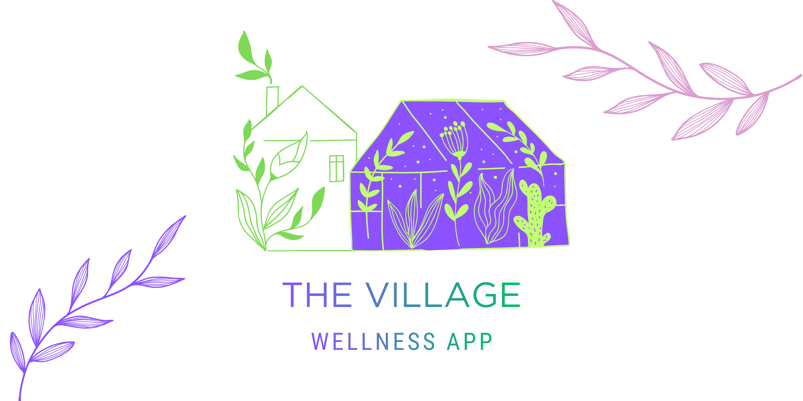

<picture>
  <source media="(prefers-color-scheme: dark)" srcset="./public/banner-dark.png">
  <source media="(prefers-color-scheme: light)" srcset="./public/banner-light.png">
  
</picture>

---

## Navigation

- [Overview of Project](#overview-of-project)
- [The Village Wellness App](#the-village-wellness-app)
- [Overview of Frontend Application](#overview-of-frontend-application)
- [Project Features](#project-features)
- [Tech Stack](#tech-stack)
- [React + Vite](#react--vite)
- [React Compiler](#react-compiler)
- [JavaScript Style Guide](#javascript-style-guide)
- [ESLint Configuration](#expanding-the-eslint-configuration)
- [Brand Guide](#brand-guide)
- [Packages](#packages)
- [System Requirements](#system-requirements)
- [Project Structure](#project-structure)
- [Error Handling](#error-handling)
- [Testing](#testing)
- [Installation](#installation)
- [Running the Server](#running-the-server)
- [Scripts](#scripts)
- [Deployment](#deployment)
- [App Preview](#app-preview)
- [App Functionality](#app-functionality)
- [Design & Accessibility](#responsive-design--accessibility)
- [Licence](#license)
- [References](#references)
- [Authors](#authors)

## Overview of Project

This frontend application was created as part of an academic Web Development assessment using MongoDB, Express.js, React and Node.js (MERN Stack). The frontend application forms the second assessable task, with the [backend application found here.](https://github.com/The-Village-Wellness-App/village-backend/tree/main)

Alternatively, visit the project [profile](https://github.com/The-Village-Wellness-App) for more information.

## The Village Wellness App

The Village Wellness App is a web-based health and wellbeing tracking application designed to help users monitor changes in their mood and physical pain over time. The application allows users to record structured entries using rating scales select predefined labels that describe their emotional or physical state, and optionally add contextual notes.
These entries are then visualised through time-based graphs, enabling users to identify patterns or trends in their wellbeing.

The application also allows users to add event markers to their timeline, such as starting a new medication, beginning therapy, or experiencing a significant life event. These markers provide additional context that may help users understand potential factors influencing their mood or pain levels. By combining structured tracking with visualisation tools, The Village Wellness App aims to support self-reflection and provide users with useful insights that may assist discussions with healthcare professionals.

# Overview of Frontend Application

The frontend of The Village website is built using React, a JavaScript library for creating interactive user interfaces. The application provides users with a responsive and user-friendly platform to access wellness-related tracking, manage their accounts, and report their current mood/pain levels with other health and wellbeing services.

# Project Features

- Create and manage accounts
- Log in securely
- Access personalised wellness tracking
- Access personalised journalling
- Graph mood/pain levels
- View and update profile information
- Navigate through different sections of the website
- Choose theme

## Tech Stack

### Chosen Technologies

- MongoDB
- Express.js
- React
- Node.js
- Vite
- Material UI
- React Router

### Purpose of Each Technology

| Technology   | Purpose                                                       |
| ------------ | ------------------------------------------------------------- |
| MongoDB      | Stores the applications data                                  |
| Express.js   | Handles API routing and middleware                            |
| React        | Builds and handles everything the users see and interact with |
| Node.js      | Runs the backend server environment                           |
| Vite         | Enables quick frontend builds                                 |
| Material UI  | Implements Google styles and components                       |
| React Router | Library providing routing capabilities                        |

### Industry Relevance

The MERN stack is widely used in modern full-stack web development due to its scalability, security, performance and ability to use JavaScript across both frontend and backend development[\*](#references).

The technologies used in the MERN stack are some of the most widely used technologies in present time.

See State of JavaScript graphs[\*](#references):

- [React Usage](https://share.devographics.com/share/prerendered?localeId=en-US&surveyId=state_of_js&editionId=js2025&blockId=front_end_frameworks_ratios&params=&sectionId=libraries&subSectionId=front_end_frameworks)
- [Express Usage](https://share.devographics.com/share/prerendered?localeId=en-US&surveyId=state_of_js&editionId=js2025&blockId=back_end_frameworks_ratios&params=&sectionId=libraries&subSectionId=back_end_frameworks)
- [Testing with Jest](https://share.devographics.com/share/prerendered?localeId=en-US&surveyId=state_of_js&editionId=js2025&blockId=testing_ratios&params=&sectionId=libraries&subSectionId=testing)

See Stack Overflow graphs[\*](#references):

- [MongoDB (No-SQL Databases)](https://survey.stackoverflow.co/2025/technology#most-popular-technologies-database-database)
- [Node, React, Express Usage](https://survey.stackoverflow.co/2025/technology#most-popular-technologies-webframe-webframe)
- [Javascript Usage](https://survey.stackoverflow.co/2025/technology#most-popular-technologies-language-language)

### Comparison to Alternative Technologies

| Chosen Technology | Alternative        | Reason Chosen                                                               |
| ----------------- | ------------------ | --------------------------------------------------------------------------- |
| MongoDB           | PostgreSQL         | Flexible, dynamic, durable, high-performance                                |
| Express.js        | Django             | Minimalist, customisable, JavaScript-based                                  |
| React             | Angular            | Component flexibility, rapid development                                    |
| Node.js           | ASP.NET            | Universal JavaScript development environment                                |
| Vite              | Next.js            | Unopinionated, lightweight, provides full control                           |
| Material UI       | Chakra UI          | More advanced, provides larger library, scalability                         |
| React Router      | Next.js App Router | Not tied to server-side architecture, unopinionated, fullstack capabilities |

### Licensing Information

| Technology   | License                           |
| ------------ | --------------------------------- |
| MongoDB      | Server Side Public License (SSPL) |
| Express.js   | MIT License                       |
| React        | MIT License                       |
| Node.js      | MIT License                       |
| Vite         | MIT Licence                       |
| Material UI  | MIT Licence                       |
| React Router | MIT Licence                       |

\*Note: Though MongoDB uses an SSPL licence, it is still appropriate to licence this project under MIT, because the application:

1. Is a public educational project
2. Uses MongoDB as an external database, and connects through Mongoose
3. Does not redistribute, modify or host MongoDB software

## React + Vite

This template provides a minimal setup to get React working in Vite with HMR and some ESLint rules.

Currently, two official plugins are available:

- [@vitejs/plugin-react](https://github.com/vitejs/vite-plugin-react/blob/main/packages/plugin-react) uses [Oxc](https://oxc.rs)
- [@vitejs/plugin-react-swc](https://github.com/vitejs/vite-plugin-react/blob/main/packages/plugin-react-swc) uses [SWC](https://swc.rs/)

## React Compiler

The React Compiler is not enabled on this template because of its impact on dev & build performances. To add it, see [this documentation](https://react.dev/learn/react-compiler/installation).

## JavaScript Style Guide

This project uses **ESLint** with the `eslint:recommended` configuration to enforce consistent code style. ESLint is configured for Node.js environments and Jest testing.

To check code style:

```bash
npm run lint
```

For more information on ESLint - [Click: ESLint Documentation.](https://eslint.org/)

For this project's internal Style Guide - [Click: JavaScript Style Guide.](https://github.com/The-Village-Wellness-App/village-documentation/blob/main/javascript-style-guide.md)

## Expanding the ESLint configuration

If you are developing a production application, we recommend using TypeScript with type-aware lint rules enabled. Check out the [TS template](https://github.com/vitejs/vite/tree/main/packages/create-vite/template-react-ts) for information on how to integrate TypeScript and [`typescript-eslint`](https://typescript-eslint.io) in your project.

## Brand Guide

This project follows a brand guide for all CSS styling - please see our [Brand Guide](https://github.com/The-Village-Wellness-App/village-documentation/blob/main/collateral/brand-guide-the-village.png) or [Documentation Repo](https://github.com/The-Village-Wellness-App/village-documentation/tree/main) for further information on our styling choices.

## Packages

```js
"@emotion/react": "^11.14.0",
"@emotion/styled": "^11.14.1",
"@fontsource/roboto": "^5.2.10",
"@fontsource/roboto-condensed": "^5.2.8",
"@mui/icons-material": "^9.1.1",
"@mui/material": "^9.1.1",
"react": "^19.2.5",
"react-dom": "^19.2.5",
"react-router-dom": "^7.17.0"

devDependencies

"@eslint/js": "^10.0.1",
"types/react": "^19.2.14",
"@types/react-dom": "^19.2.3",
"@vitejs/plugin-react": "^6.0.1",
"eslint": "^10.2.1",
"eslint-plugin-react-hooks": "^7.1.1",
"eslint-plugin-react-refresh": "^0.5.2",
"globals": "^17.5.0",
"vite": "^8.0.10"
```

## System Requirements

- Node.js (LTS recommended, v18+)
- npm
- Modern web browser (Chrome, Firefox, Edge)
- Recommended: 512MB+ RAM for small deployments

## Project Structure

```bash
📁 village-frontend
    📁 public
        ─ icons.svg
    📁 src
        📁 assets
            ─ react.svg
            ─ vite.svg
        📁 components
            ─ Footer.jsx
            ─ Header.jsx
            ─ Header.module.css
            ─ Navbar.jsx
        📁 layouts
            ─ main-layout.jsx
            ─ register-login-layout.jsx
        📁 pages
            ─ dashboard-page.jsx
            ─ event-page.jsx
            ─ graph-report-page.jsx
            ─ home-page.jsx
            ─ login-page.jsx
            ─ mood-page.jsx
            ─ pain-page.jsx
        ─ App.css
        ─ App.jsx
        ─ fonts.css
        ─ index.css
        ─ main.jsx
        ─ theme.js
    ─ eslint.config.js
    ─ index.html
    ─ LICENSE
    ─ package-lock.json
    ─ package.json
    ─ README.md
    ─ vite.config.js
```

## Error Handling

Placeholder

## Testing

Placeholder

## Installation

Clone, install, then run locally:

```bash
git clone https://github.com/The-Village-Wellness-App/village-frontend.git
cd village-front end
npm install
npm run build   # or `npm run dev` for hot-reloading
```

## Running the Server

Run the production server by entering into the terminal
`npm run start`

Preview Production Build
`npm run preview`

Or if you want hot-reloading, run dev mode
`npm run dev`

The app will run at: [http://localhost:5173](http://localhost:5173)

## Scripts

The following scripts can be used for this project:

| Script    | Description                                          |
| --------- | ---------------------------------------------------- |
| `dev`     | Starts the development server with automatic reloads |
| `build`   | Builds the production server                         |
| `lint`    | Checks code for style breaches or errors             |
| `preview` | Preview the build                                    |

## Deployment

This project is deployed on Netlify.

Build command: npm run build  
Publish directory: dist
Link: []()

## App Preview

Placeholder

## App Functionality

Placeholder

# Responsive Design & Accessibility

Placeholder

## License

This project is licensed under the MIT License. See the [LICENSE](./LICENSE) file for details.

This project uses third-party technologies including MongoDB, which is licensed under the Server Side Public License (SSPL).

## References

> [MongoDB. (2026). _MERN Stack Explained_. Retrieved May 24, 2026, from https://www.mongodb.com/resources/languages/mern-stack](#tech-stack)

> [State of JavaScript. (2025). _State of JavaScript 2025: Libraries_. Retrieved May 24, 2026, from https://2025.stateofjs.com/en-US/libraries/](#tech-stack)

> [Stack Overflow. (2025). _2025 Developer Survey_. Retrieved May 24, 2026, from https://survey.stackoverflow.co/2025/](#tech-stack)

## Authors

Created by [WhiteHotThrash](https://github.com/tim-maastricht) & [✨BeeGeeEss✨](https://github.com/BeeGeeEss)
